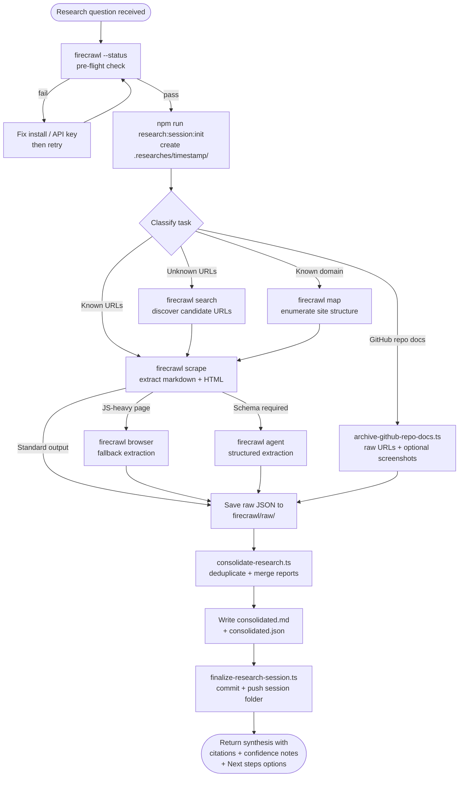

# research-online
A Claude Code skill that runs end-to-end online research sessions using Firecrawl CLI as the primary retrieval layer. It initialises a timestamped artifact directory, collects multi-source evidence, deduplicates and consolidates findings, and publishes a reproducible session payload — returning source-backed answers with explicit confidence notes.

## Install

The fastest cross-agent install path is the `skills` CLI:

```bash
npx skills add gg-skills/research-online
```

Drop this skill into a workspace as a Git submodule for pinned versions, or as a plain clone for latest `main`:

```bash
# Project-local, version-pinned:
git submodule add git@github.com:gg-skills/research-online.git .claude/skills/research-online

# OR project-local, latest main:
mkdir -p .claude/skills
git -C .claude/skills clone git@github.com:gg-skills/research-online.git

# OR user-level, available in every project on this machine:
mkdir -p ~/.claude/skills
git -C ~/.claude/skills clone git@github.com:gg-skills/research-online.git
```

Restart your agent or reload skills after installation. See the parent [`skills` catalog repo](https://github.com/gg-skills/skills) for the full catalog.

## When to use

- User asks for current web information, multi-source discovery, or site mapping.
- Task requires structured extraction from web pages or autonomous research.
- Research involves comparing documentation across multiple sites.
- Need to verify a claim against live web sources.
- Working with GitHub repository documentation that needs faithful archival.

Skip when the question can be answered from the local codebase or committed documentation, when the user explicitly asks for opinion or creative writing without factual grounding, or when a sibling skill (e.g. `firecrawl`) already covers the specific tool surface in isolation.

## How it operates

### Inputs

| Input | Description |
|-------|-------------|
| Research question | Free-text query passed via `--query` to session-init and consolidation scripts. |
| Target sources | Optional: explicit URLs for `scrape`/`crawl`, or left open for `search`-driven discovery. |
| Freshness requirements | Optional: `--max-age` hint passed to Firecrawl CLI to allow cache hits during iterative runs. |
| GitHub repo target | Optional: `--github-repo` and `--branch` flags for the archival script path. |
| Format preference | Optional: `thematic`, `chronological`, or `source` passed to `consolidate-research.ts`. |

### Outputs

| Output | Location |
|--------|----------|
| Session metadata | `.researches/<timestamp>/metadata.json` |
| Raw Firecrawl dumps | `.researches/<timestamp>/firecrawl/raw/` |
| Per-source reports | `.researches/<timestamp>/firecrawl/reports/` |
| Documentation markdown | `.researches/<timestamp>/documentation/markdown/` |
| Documentation HTML | `.researches/<timestamp>/documentation/html/` |
| Full-page screenshots | `.researches/<timestamp>/documentation/screenshots/full-page/` |
| Subagent reports | `.researches/<timestamp>/subagent-reports/` |
| Consolidated markdown | `.researches/<timestamp>/consolidated.md` |
| Consolidated JSON | `.researches/<timestamp>/consolidated.json` |

### External commands

| Command | Purpose |
|---------|---------|
| `firecrawl --status` | Pre-flight check; must succeed before any collection step. |
| `firecrawl search` | Discovery phase — locate candidate URLs from a query. |
| `firecrawl map` | Site structure enumeration for known domains. |
| `firecrawl scrape` | Single-page extraction in markdown and/or HTML. |
| `firecrawl crawl` | Multi-page recursive extraction with `--limit` and `--max-depth` guards. |
| `firecrawl agent` | Autonomous structured extraction; used only when a schema is required or deterministic commands fail. |
| `firecrawl browser` | JS-heavy or interactive page fallback; version-dependent — prefer explicit `firecrawl browser execute --node …` over shorthand. |
| `npm run research:session:init` | Bootstraps the timestamped session directory and writes `metadata.json`. |
| `npx tsx scripts/consolidate-research.ts` | Deduplicates and merges reports into `consolidated.md` + `consolidated.json`. |
| `npx tsx scripts/finalize-research-session.ts` | Publishes the completed session with a scoped commit/push. |
| `npx tsx scripts/archive-github-repo-docs.ts` | Archives GitHub repo docs via raw URLs + optional screenshots, bypassing blob-page noise. |

### Side effects

- **File writes** — session directory tree created under `.researches/<timestamp>/` in the working project.
- **Network requests** — Firecrawl API calls for every `search`, `scrape`, `map`, `crawl`, `agent`, or `browser` invocation; costs real API credits.
- **Git commits/push** — `finalize-research-session.ts` commits and pushes the session folder when `--dry-run` is not set.
- **Environment variable** — `FIRECRAWL_OUTPUT_DIR` is set per session to route raw outputs; `FIRECRAWL_API_KEY` must be present in the shell.

### Mode toggles

| Toggle | Effect |
|--------|--------|
| `--no-publish` | Skip commit/push at finalize step; keeps session local. |
| `--dry-run` | Print what would be committed without writing to remote. |
| `--no-dedupe` | Disable deduplication in consolidation; useful when source overlap is intentional. |
| `--max-age <seconds>` | Allow Firecrawl cache hits; lowers cost during iterative debugging. |
| `--screenshot-mode` | Enable full-page screenshot capture in the archival script. |

## Operational flow



## Layout

```
research-online/
├── SKILL.md                         # Skill descriptor and full policy
├── README.md                        # This file
├── agents/
│   └── openai.yaml                  # Agent definition
├── assets/                          # Skill icons
│   ├── icon-large.png / .svg
│   └── icon-small.svg
├── references/
│   ├── consolidation-patterns.md    # Six strategies for merging subagent findings
│   ├── github-repository-doc-archival.md  # Hybrid archival pattern for GitHub repos
│   ├── harness-patterns.md          # Six patterns for parallelising Firecrawl research
│   └── tool-selection.md            # CLI command decision tree + flag summary
└── scripts/
    ├── init-research-session.ts     # Bootstrap timestamped session directory
    ├── save-research.ts             # Import pre-existing temp files into a session
    ├── consolidate-research.ts      # Deduplicate and merge into consolidated outputs
    ├── finalize-research-session.ts # Publish completed session via commit/push
    ├── archive-github-repo-docs.ts  # Archive GitHub repo docs faithfully
    └── research-session.ts          # Library: session directory layout helpers
```

## Quick start

```bash
# 1. Verify Firecrawl is ready
firecrawl --status

# 2. Initialise a session
npm run research:session:init -- --query "What changed in Next.js 15?"

# 3. Discover sources
export FIRECRAWL_OUTPUT_DIR=".researches/<timestamp>/firecrawl/raw"
firecrawl search "site:nextjs.org Next.js 15" --scrape --limit 10 --json \
  -o "$FIRECRAWL_OUTPUT_DIR/search.json"

# 4. Deep-dive a page (dual representation)
firecrawl scrape "https://nextjs.org/blog/next-15" --format markdown \
  -o ".researches/<timestamp>/documentation/markdown/next-15.md"
firecrawl scrape "https://nextjs.org/blog/next-15" --format html \
  -o ".researches/<timestamp>/documentation/html/next-15.html"

# 5. Consolidate
npx tsx .claude/skills/research-online/scripts/consolidate-research.ts \
  --input-dir .researches/<timestamp>/firecrawl/reports \
  --query "What changed in Next.js 15?" \
  --format thematic

# 6. Publish
npx tsx .claude/skills/research-online/scripts/finalize-research-session.ts \
  --latest
```

## Resources

- [firecrawl](https://github.com/gg-skills/firecrawl) — low-level CLI primer; load on-demand for command syntax, flag semantics, install/auth steps.
- [Firecrawl documentation](https://docs.firecrawl.dev) — upstream reference.
- `references/tool-selection.md` — command decision tree and cost guardrails.
- `references/harness-patterns.md` — parallelisation patterns for high fan-out research.

## Caveats

- **CLI-first policy is non-negotiable.** The built-in `web` tool is a fallback of last resort; always attempt Firecrawl CLI first and document why it was insufficient if you fall back.
- **Firecrawl API credits are real money.** Scope crawls with `--limit` and `--max-depth`; use `--max-age` to hit cache on iterative runs; escalate to `agent`/`browser` only when cheaper commands fail.
- **Dual representation contract.** Documentation targets must be saved in both markdown and HTML; markdown-only is incomplete.
- **GitHub blob pages are noisy.** Use `raw.githubusercontent.com` URLs or `archive-github-repo-docs.ts` — never scrape the blob-rendered page as canonical source text.
- **`firecrawl browser` shorthand is fragile.** It is version-dependent; prefer `firecrawl browser execute --node …` explicitly.
- **Snapshot age.** SKILL.md was verified 2026-04-30. Validate Firecrawl CLI flag behaviour with `firecrawl --help` before relying on command syntax for newly released versions.
